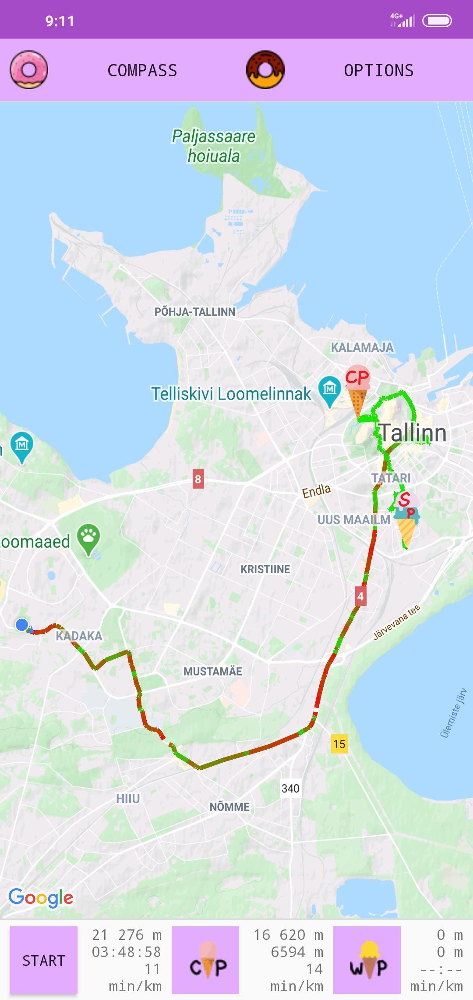
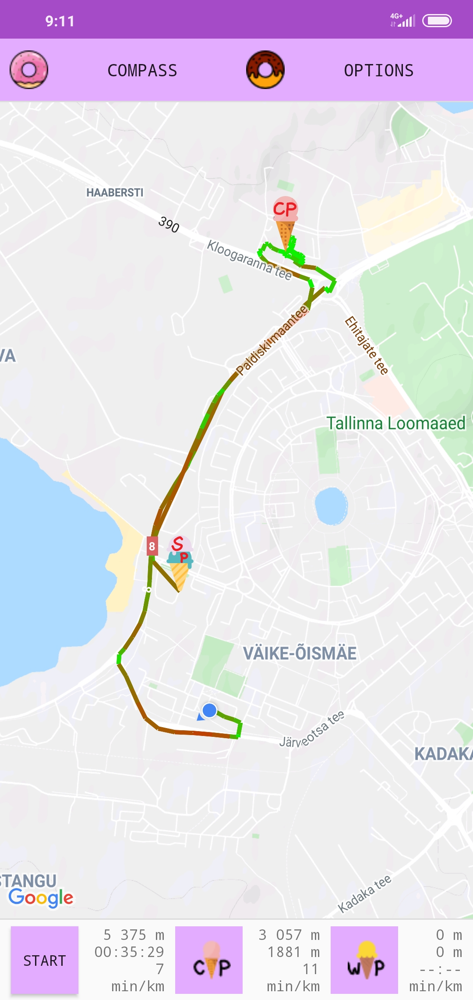
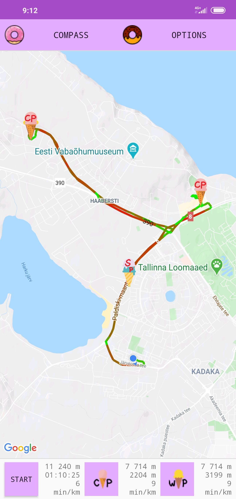
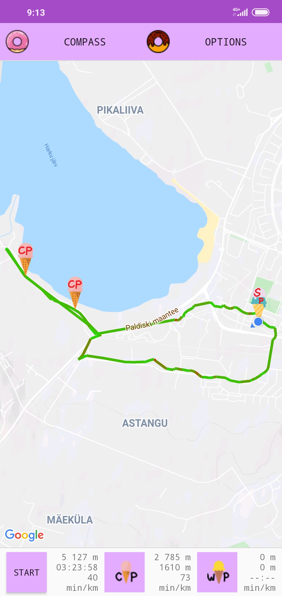
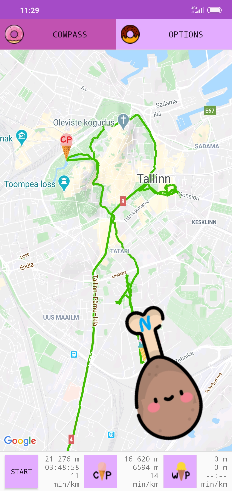
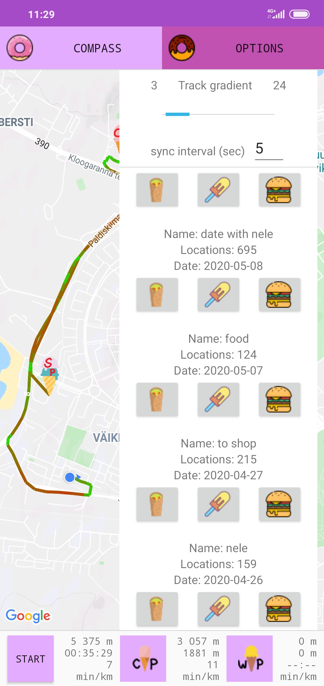

Sport Maps

| Gradient is calculated      | Add way points and capture points      |  Keep everything in sync      |  Review old sessions      |  Compass      |  Options      | 
|------------|-------------|-------------|-------------|-------------|-------------| 
| | | | | | |

Features: 
 * Add way points and capture points
 * Draw road passed by user
 * Keep local database and remote database in sync
 * Keep service completely distinct front GameView
 * Display and use compass for better direction
 * Customize track gradient
 * Change sync interval
 * Delete / edit / display old sessions
 * Change mode: Centered - North up - Direction up - User choice up